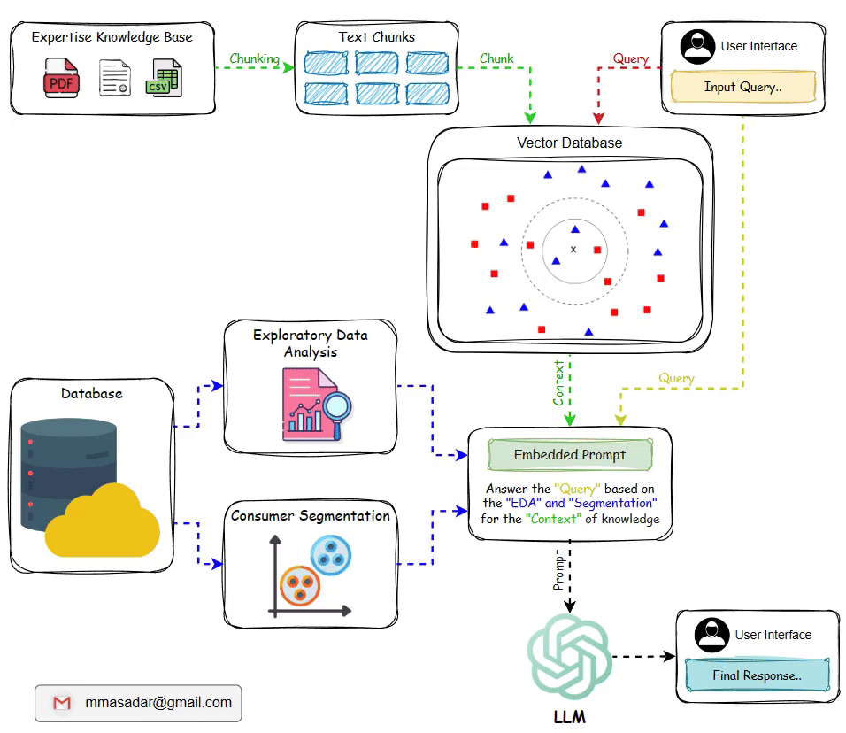

# Retrieval Augmented Generation (RAG) Project – LLM for Market Analysis

This project is an interactive dashboard providing a profound understanding of customer behavior and Key Performance Indicator (KPI) analysis derived from customer data. It facilitates the identification of customer segments, reveals trends, and offers invaluable insights into customer engagement with your business.

The development of InsightGPT, a market analysis consultancy based on Large Language Model (LLM) utilizing Retrieval Augmented Generation (RAG), referencing data analysis results and scientific market theories from various papers. This enables deeper and more reliable analysis tailored to prevailing market conditions.

## Retrieval Augmented Generation (RAG) and Large Language Model (LLM)
This project harnesses the power of Retrieval Augmented Generation (RAG) in a Large Language Model (LLM) to unlock profound insights and unravel intricate relationships from customer data. Through the innovative fusion of retrieval and generation techniques, our RAG-LLM offers a dynamic approach to understanding customer behavior and preferences.

By fine-tuning the RAG-LLM on a specific dataset, we enhance its capacity to delve deep into the nuances of customer interactions, illuminating hidden patterns and uncovering invaluable insights. Join us on this journey as we leverage cutting-edge technology to revolutionize customer analytics and empower decision-making processes.

### Model Architecture

The LLM is based on the [Transformer architecture](https://arxiv.org/abs/1706.03762) with [BERT-like embeddings](https://arxiv.org/abs/1810.04805). It has been trained on a large corpus of text data to develop a strong understanding of language structures and semantics.

### Fine-tuning

The LLM has been fine-tuned on a customer dataset to adapt its general language understanding capabilities to the specific context of customer behavior and preferences. This fine-tuning process involves training the model on the customer dataset for several epochs to minimize the loss function and improve the model's performance.

### Usage in the Dashboard

The LLM is used to analyze customer data and extract meaningful insights. These insights are then visualized in the dashboard using interactive visualizations, allowing users to explore and compare customer segments.

## Features

- Customer clustering based on various factors such as spending behavior, product preference, loyalty, engagement, demographics, and payment & shipping preferences
- Interactive visualizations to explore and compare customer segments
- Customizable themes: dark mode and funky mode
- Discussion about the data using Multimodal LLM

## Getting Started

To run the project, follow these steps:

1. Clone the repository: 
bash git clone https://github.com/username/customer-segmentation-dashboard.git
2. Navigate to the project directory:
bash cd customer-segmentation-dashboard
3. Install the required packages:
bash pip install -r requirements.txt
4. Run the application:
bash streamlit run app.py

## Usage

1. Select a cluster to analyze from the sidebar.
2. Explore the interactive visualizations to understand the cluster's characteristics.
3. Customize the theme to your preference.

## Dependencies

- Python 3.7+
- NumPy
- Pandas
- Streamlit
- Plotly
- openai

## Contributing

We welcome contributions! Please submit a pull request with your proposed changes.

## Authors and Acknowledgment

- [Masdar](https://www.linkedin.com/in/muhammad-masdar-mahasin-66914378/)
- by Masdar's Personal Project (https://mahaseenlab.com/)
